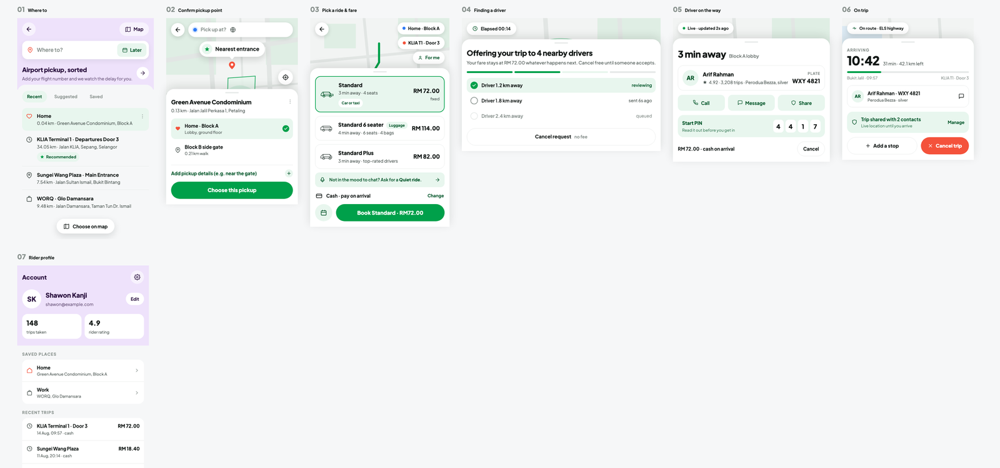
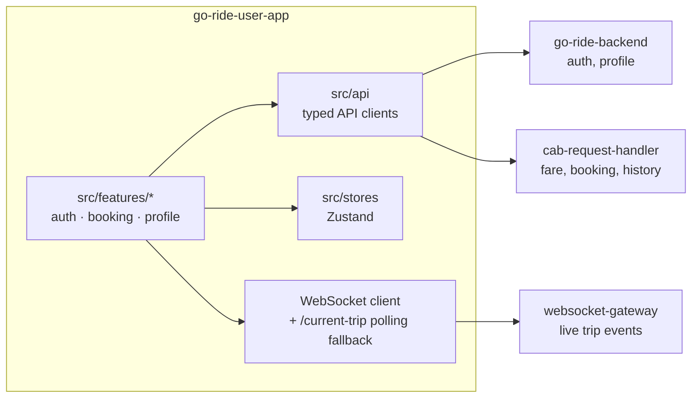

# Go Ride — Rider App

The rider-facing mobile app for **Go Ride**, a ride-hailing platform. Built with Expo/React Native, it lets a rider get a fare estimate, book a cab against that locked quote, watch it get matched and tracked live on a map, ride through to completion, and confirm a cash payment — end to end, without losing track of trip state through a dropped WebSocket connection or a silently-retried dispatch.

It talks directly to two backend services: **[go-ride-backend](https://github.com/shawon-kanji/go-ride-backend)** (auth, profile) and **[go-ride-kafka-consumers](https://github.com/shawon-kanji/go-ride-kafka-consumers)** (fare quoting, booking, realtime tracking via `cab-request-handler` and `websocket-gateway`).

<p align="center">
  
  
  
  
  
  
</p>

## Screens

Search → confirm pickup → pick a ride and fare → live matching → driver en route → on trip → profile.



## What it does

- **Auth** — email/password signup and login against `go-ride-backend`, 60-minute sessions with proactive expiry warnings (no refresh-token endpoint exists on the backend, by design).
- **Fare estimate → booking** — shows three priced tiers up front; booking consumes the chosen quote rather than re-sending pickup/dropoff, matching the backend's "quote, then book against it" contract.
- **Live matching** — a searching state that tolerates the backend's silent dispatch retries (radius widening, exponential backoff) without surfacing them as errors.
- **Realtime tracking** — driver location, ETA, and trip-state pushes over `GET /api/v1/ws/rider`, with `/current-trip` polling as a backstop for a missed or dropped socket.
- **Cash trip completion** — start (PIN-verified by the driver), en-route, arrival, and driver-confirmed cash collection — the rider only observes payment status, matching the backend's cash-only model.

## Architecture



No unified API gateway exists across the platform — this app talks to `go-ride-backend`, `cab-request-handler`, and `websocket-gateway` directly. There's no OpenAPI spec anywhere either, so the TypeScript API types in `src/api` are hand-maintained mirrors of the Go DTOs, verified directly against source rather than codegenned.

## Tech stack

| Layer | Choice |
|---|---|
| Framework | Expo SDK 57, custom dev client (not Expo Go), React Native 0.86, React 19 |
| Language | TypeScript, strict mode |
| Routing | Expo Router (file-based) |
| Styling | NativeWind (Tailwind for React Native) |
| State | Zustand |
| Server state | TanStack Query |
| Forms | React Hook Form + Zod |
| Maps | `react-native-maps` |
| Testing | Jest + React Native Testing Library |

## Getting started

```bash
cp .env.example .env
npm install
npm start          # expo start
npm run android
npm test
```

Requires the sibling repos running: `go-ride-backend` and `go-ride-kafka-consumers` (via `go-ride-infra`'s local compose stack).

## Product scope, honestly

Deliberately out of scope for this MVP, matching real gaps in the backend rather than product oversights: ratings/reviews, ride history (no `GET` endpoint exposes it yet), in-app payment (cash only), promo codes, push notifications (WebSocket-only for now), surge pricing display (hardcoded to `1.0` server-side), and account deactivation (exists on the backend but deserves its own confirm-UX pass rather than a rushed v1 add).

## Design system

Shares a placeholder theme and generic component set (`Button`, `Card`, `Badge`, `TextInput`, `Select`, `Stepper`, `Banner`, `ConfirmDialog`, `EmptyState`) with the sibling driver app — a joint "bold, Bolt/Grab-esque" brand pass across both apps is a deferred later phase, not an oversight in this build.
